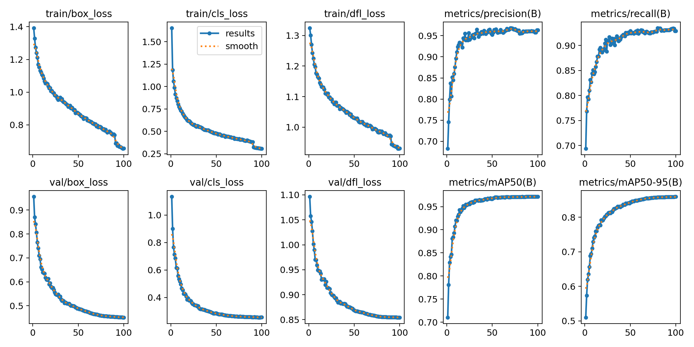
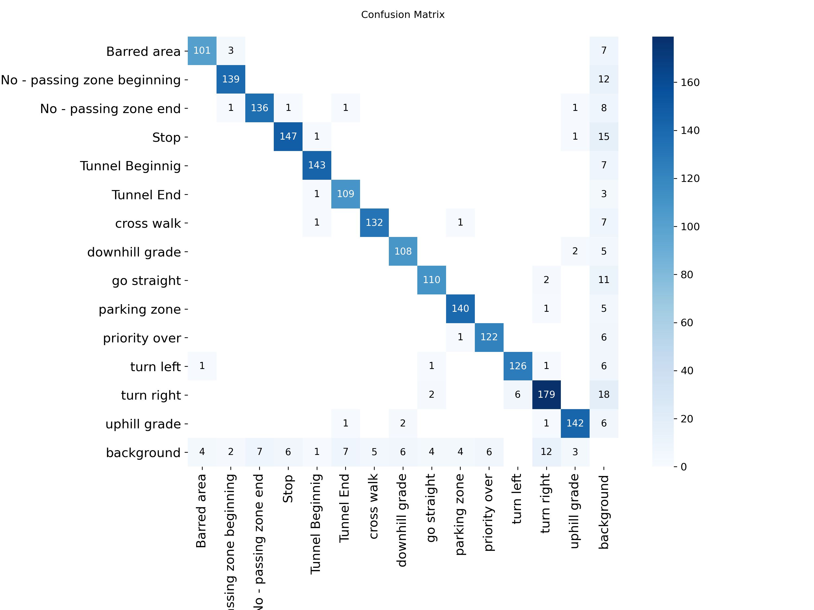
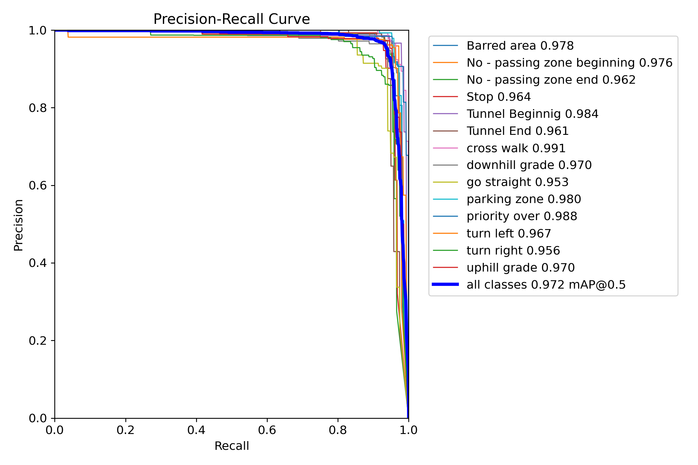

# Real-time Traffic Sign Detection using YOLOv8s


A high-performance computer vision project focused on detecting and classifying traffic signs in real-time. This project leverages the **YOLOv8s (Small)** architecture to achieve an optimal balance between inference speed and detection accuracy, making it suitable for deployment on edge devices and GPU-accelerated environments.

---

## 📊 Performance & Metrics
The model has been rigorously trained and evaluated. Detailed logs and raw data can be found in the `results/` directory.

### Training Progress
The following plots illustrate the improvement in precision, recall, and loss functions over the training epochs:


### Model Confusion Matrix
The confusion matrix highlights the model's ability to distinguish between different traffic sign classes:


### Precision-Recall Curve
A visualization of the trade-off between precision and recall for all detected classes:


---

## 🛠 Installation & Setup

### 1. Clone the Repository
```bash
git clone https://github.com/atenabr82/BSc-realtime-traffic-sign-yolov8s.git
cd BSc-realtime-traffic-sign-yolov8s
2. Environment Configuration
It is recommended to use a virtual environment to avoid dependency conflicts:

Bash

python -m venv venv
# Activate on Windows:
.\venv\Scripts\activate
# Activate on Linux/Mac:
source venv/bin/activate
3. Install Dependencies
Bash

pip install -r requirements.txt
🖼 Detection Samples
Below are sample detections from the validation set, demonstrating the model's performance on unseen data:

Note: The model correctly identifies overlapping signs and varying lighting conditions.

📂 Project Structure
results/: Contains all performance charts, confusion matrices, and the results.csv data file.

requirements.txt: List of Python libraries required to run the project.

🚀 Future Improvements
[ ] Integration with a tracking algorithm (e.g., DeepSORT) for video streams.

[ ] Quantization to INT8/FP16 for faster inference on mobile devices.

[ ] Expansion of the dataset to include rare weather conditions (heavy rain/snow).

📄 License
This project is licensed under the MIT License.
